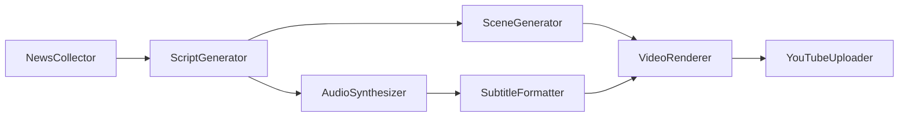

# 2511YouTuber Project Handbook

> [!IMPORTANT]
> This document serves as the **Single Source of Truth** for the 2511YouTuber project. It consolidates all goals, architecture, technical specifications, user guides, and operational playbooks into one comprehensive manual. It integrates information from `README.md`, `AGENTS.md`, `docs/system_overview.md`, `docs/operations.md`, `docs/automation_playbook.md`, `docs/markets/qualification.md`, and more.

---

## Table of Contents

1.  [Ultimate Purpose & Vision](#1-ultimate-purpose--vision)
2.  [System Architecture & Design](#2-system-architecture--design)
3.  [Directory Structure & Code Organization](#3-directory-structure--code-organization)
4.  [Core Workflow & Components](#4-core-workflow--components)
5.  [Configuration & Customization](#5-configuration--customization)
6.  [Operations & Automation](#6-operations--automation)
7.  [Development Guidelines](#7-development-guidelines)
8.  [Feature Specifications](#8-feature-specifications)
    *   [Thumbnail Generation](#81-thumbnail-generation)
    *   [Video Generation Methods](#82-video-generation-methods)
    *   [Qualification Series (Market Spec)](#83-qualification-series-market-spec)
9.  [Troubleshooting & Known Issues](#9-troubleshooting--known-issues)

---

## 1. Ultimate Purpose & Vision

### Vision
To create a fully autonomous, high-quality video generation system that produces engaging financial and educational news content for YouTube. The system aims to minimize human intervention while maximizing viewer engagement ("Wow Score") through cinematic visuals, natural narration, and insightful scriptwriting.

### Core Objectives
1.  **Automation**: End-to-end automation from news gathering to video rendering and upload.
2.  **Quality**: Produce videos that rival human-made content in terms of visual appeal, audio quality, and narrative structure.
3.  **Maintainability**: Adhere to Clean Architecture principles to ensure the codebase is scalable, testable, and easy to modify.
4.  **Reliability**: Robust error handling, self-recovery mechanisms, and comprehensive monitoring.

### Target Audience (Customer)
-   **Primary**: Japanese YouTube viewers interested in finance, economy, investment news, and qualification exam preparation (e.g., Takken, Boki).
-   **Secondary**: Tech-savvy users who want to run their own AI video generation pipeline.

---

## 2. System Architecture & Design

### High-Level Overview
The system follows a linear pipeline architecture orchestrated by a central workflow engine. It processes data through a series of modular "Steps". The `apps.youtube` runner constructs a timestamped `run_id`, resolves the configured output directory, and instantiates all enabled steps before handing them to `WorkflowOrchestrator`.



### Clean Architecture Implementation
The project strictly adheres to Clean Architecture principles to decouple business logic from external frameworks and tools.

-   **Entities (`src/models.py`)**: Core data structures (e.g., `NewsItem`, `Script`, `ScriptSegment`) that are independent of any framework.
-   **Use Cases (Steps)**: Application-specific business rules (e.g., `NewsCollector`, `ScriptGenerator`). These orchestrate the flow of data.
-   **Interface Adapters (Providers/Services)**: Abstractions for external tools (e.g., `GeminiProvider`, `VOICEVOXProvider`, `ZImageTurboService`). Steps depend on these interfaces, not concrete implementations.
-   **Frameworks & Drivers (`apps/`, `src/utils/`)**: External details like CLI entry points, configuration loading, and database access.

### Dependency Injection (DI)
All dependencies are injected into Steps via their constructors. This allows for easy testing and swapping of implementations.
-   **Composition Root**: `apps/youtube/cli.py` acts as the composition root, wiring together Steps and their dependencies based on configuration.

---

## 3. Directory Structure & Code Organization

The repository is organized to separate concerns and facilitate maintenance.

| Directory | Description |
| :--- | :--- |
| `apps/` | Application entry points (e.g., `apps/youtube/cli.py`). The "Main" component in Clean Architecture. |
| `config/` | **Central Configuration Hub**. Contains `default.yaml` (settings), `prompts.yaml` (LLM prompts), and `.env` examples. |
| `docs/` | Documentation files. `PROJECT_HANDBOOK.md` is the master doc. |
| `scripts/` | Automation scripts (`voicevox_manager.sh`, `automation.py`) and utilities. |
| `src/` | Source code. Contains `core/`, `steps/`, `providers/`, `models.py`, `utils/`. |
| `tests/` | Test suite (`unit`, `integration`, `e2e`). |
| `runs/` | **Runtime Artifacts**. Created on demand. Stores outputs (`video.mp4`, `script.json`) and state (`state.json`). |
| `assets/` | Static assets like fonts, character images, and intro/outro videos. |

### Key Files
-   **`config/default.yaml`**: The single source of truth for configuration. All toggles and parameters live here.
-   **`src/core/step.py`**: Base class for all steps. Handles artifact checking and skipping.
-   **`src/core/orchestrator.py`**: Manages step execution and state persistence.
-   **`Taskfile.yml`**: Defines build tasks and commands (`task run`, `task test`).

---

## 4. Core Workflow & Components

### The Pipeline Steps
1.  **`NewsCollector`** (`src/steps/news.py`)
    *   **Responsibility**: Gather recent finance stories.
    *   **Logic**: Queries Perplexity (search) and Gemini (filtering/summarization). Uses fallback logic.
    *   **Output**: `news.json` (List of `NewsItem`).
2.  **`ScriptGenerator`** (`src/steps/script.py`)
    *   **Responsibility**: Write a structured dialogue script.
    *   **Logic**: Prompts Gemini with headlines, speaker profiles, and context from previous runs.
    *   **Output**: `script.json` (List of `ScriptSegment`).
3.  **`AudioSynthesizer`** (`src/steps/audio.py`)
    *   **Responsibility**: Synthesize voiceover.
    *   **Logic**: Calls VOICEVOX API for each segment. Concatenates into a single WAV.
    *   **Output**: `audio.wav`.
4.  **`SceneGenerator`** (`src/steps/scene_generator.py`)
    *   **Responsibility**: Generate background visuals.
    *   **Logic**: Uses `ZImageTurboService` (local diffusion model) to create atmospheric images based on script content.
    *   **Output**: `scenes/` (Directory of images).
5.  **`SubtitleFormatter`** (`src/steps/subtitle.py`)
    *   **Responsibility**: Create subtitles.
    *   **Logic**: Estimates timing, wraps Japanese text for readability, generates SRT.
    *   **Output**: `subtitles.srt`.
6.  **`VideoRenderer`** (`src/steps/video.py`)
    *   **Responsibility**: Render final video.
    *   **Logic**: Uses FFmpeg to combine audio, images (with Ken Burns effect), and subtitles.
    *   **Output**: `video.mp4`.
7.  **Optional Steps**:
    *   `MetadataAnalyzer`: Generates SEO titles/tags (`metadata.json`).
    *   `ThumbnailGenerator`: Creates thumbnails (`thumbnail.png`).
    *   `YouTubeUploader`: Uploads to YouTube.
    *   `TwitterPoster`: Posts clips to X/Twitter.
    *   `LinkedInPoster`: Posts text/images to LinkedIn (Trust Layer).
    *   `HatenaPoster`: Posts articles to Hatena Blog (Knowledge Layer).

### Providers (Interface Adapters)
-   **`GeminiProvider`**: Handles Google Gemini API calls, retries, and key rotation.
-   **`VOICEVOXProvider`**: Manages local VOICEVOX engine, speaker mapping, and audio queries.
-   **`ZImageTurboService`**: Interfaces with the local Z-Image-Turbo model for image generation.

---

## 5. Configuration & Customization

### `config/default.yaml`
This file controls the entire behavior of the system.

-   **`workflow`**: Global settings (run directory, checkpoints).
-   **`steps`**: Per-step configuration.
    -   `news`: Query (`steps.news.query`), count, stopwords. **DO NOT shorten the query.**
    -   `script`: Duration limits, speaker profiles.
    -   `scene_generator`: Model path, resolution, steps.
    -   `video`: Resolution, FPS, encoder settings.
-   **`providers`**: Provider-specific settings.
    -   `llm`: Model selection, temperature.
    -   `tts`: Voicevox URL, speaker mapping.
    -   `linkedin`: Access token, author URN.
    -   `hatena`: Hatena ID, blog ID, API key.

### `config/prompts.yaml`
Contains the prompt templates for LLMs.
-   **News Prompts**: Instructions for filtering and summarizing news.
-   **Script Prompts**: Directives for character personas (e.g., Tsumugi, Zundamon) and dialogue style.

### `config/scene_prompts.yaml`
Defines prompts for the `SceneGenerator`, categorized by style (literal, abstract, atmospheric).

---

## 6. Operations & Automation

### Quick Start Commands
-   **Setup**: `task bootstrap` (Installs dependencies, starts services, sets up cron).
-   **Run**: `task run` (Runs the default workflow).
-   **Run with Query**: `task run -- --news-query "Topic"`
-   **Check Status**: `task services:status`

### Automation Playbook
The system is designed to run autonomously via Cron.

-   **Schedule**: Runs every 4 hours (default). Defined in `scripts/run_workflow_cron.sh`.
-   **Services**:
    -   **Voicevox**: Must be running (managed via `scripts/voicevox_manager.sh`).
    -   **Aim**: Dashboard for experiment tracking (port 43800).
    -   **Discord Bot**: For notifications and manual triggers.
-   **Logs**: Written to `logs/automation/`.

### Maintenance
-   **Disk Space**: `runs/` directory grows over time. Archive and delete old runs periodically.
-   **API Keys**: Rotate keys in `.env` if quotas are exceeded.
-   **Service Health**: Use `task services:status` to ensure Docker containers and Python processes are alive.

---

## 7. Development Guidelines

### Coding Standards
-   **Language**: Python 3.11+
-   **Style**: Snake_case for functions/vars, PascalCase for classes.
-   **Type Hints**: **Mandatory** and exhaustive.
-   **Error Handling**: Fix root causes. Do not suppress errors blindly.
-   **DRY**: Don't Repeat Yourself.
-   **Configuration**: No hardcoded values. Use `config/default.yaml`.

### Testing Strategy
-   **Fast Tests (`task test:fast`)**: Unit tests and integration tests that skip heavy video rendering. Use for quick feedback.
-   **All Tests (`task test:all`)**: Includes E2E tests with FFmpeg rendering.
-   **E2E Tests**: Use real API keys (Gemini, Perplexity) to verify live integration.

### Git Workflow
-   **Commit Messages**: Imperative mood (e.g., "Add feature", "Fix bug").
-   **Pull Requests**: Document changes, link issues, provide test evidence.

---

## 8. Feature Specifications

### 8.1 Thumbnail Generation
-   **Implementation**: `src/steps/thumbnail.py`.
-   **Logic**: Generates a PNG based on the script title and metadata.
-   **Palettes**: Uses presets defined in `src/steps/thumbnail.py` (can be overridden in config).
-   **Assets**: Uses character images from `assets/`.

### 8.2 Video Generation Methods
(Based on `docs/new_video_generation_methods.md`)
-   **Strategy**: Hybrid approach.
    -   **Short Term**: Use free stock footage (Pexels, Pixabay).
    -   **Medium Term**: Supplement with Luma Dream Machine (PiAPI) for specific scenes (approx $0.02/sec).
    -   **Long Term**: Monitor Sora API.
-   **Optimization**:
    -   **Caching**: LRU + TTL (24h) for stock footage.
    -   **Fallback**: Pexels -> Pixabay -> Generation.
    -   **Reuse**: Generate generic clips (Intro/Outro/Transition) once and reuse them to save costs.

### 8.3 Qualification Series (Market Spec)
(Based on `docs/markets/qualification.md`)
This project supports a "Qualification Series" (e.g., Takken, Boki) in addition to financial news.

-   **Structure**:
    -   **Season**: The exam series (e.g., `takken`).
    -   **Arc**: The topic (e.g., `gyomu` - Business Law).
    -   **Episode**: Individual video.
-   **Configuration**:
    -   Managed via `config/packs/<season>.yaml`.
    -   Defines exam dates, curriculum coverage, and release schedule.
-   **Content Pattern**:
    -   **Takken**: Clause citation -> Typical Question -> Trap Case -> Reason -> Teaser.
    -   **Boki**: Journal Entry -> Concept -> Calculation -> Answer -> Review.
-   **Quality Control**:
    -   **Disclaimer**: Must state "Unofficial" and "Possibility of Law Revision".
    -   **TTS**: Strict separation of roles (Lecturer, Student, Mentor).

---

## 9. Troubleshooting & Known Issues

### Common Issues
-   **`NewsCollector` Failures**: Often due to API key quotas or timeouts. Check `.env` and logs.
-   **FFmpeg Errors**: Ensure `ffmpeg` is installed and accessible in PATH.
-   **Voicevox Connection Refused**: The Docker container might be down. Run `task voicevox:start`.

### Known Bugs (from `ISSUE.md`)
-   **Fast Tests Failing**: `test_custom_news_query` and `test_different_duration_configs` have been known to fail due to `NewsCollector` configuration issues or missing API keys in the test environment.
    -   *Mitigation*: Ensure valid keys are present and `NewsCollector` error handling is robust.

### Debugging
-   **Logs**: Check `logs/` directory.
-   **Aim**: Use `task aim:dashboard` to visualize run metrics and inputs/outputs.
-   **State**: Inspect `runs/<run_id>/state.json` to see the status of each step.

---

## 8. Prompt Management & Versioning

The system automatically versions every prompt template used in a run.

### Reviewing History
Use the Aim UI to compare prompts and results:
```bash
task prompt:review
```
Navigate to the dashboard to see inputs, prompts, and outputs side-by-side.

### Restoring a Previous Version
To revert `config/prompts.yaml` to a previous state:

1.  **Find the Run ID**:
    *   Use the timestamp folder name (e.g., `20251206_100224`).
    *   OR check `runs/<timestamp>/state.json` for the `"aim_run_id"`.
2.  **Run the restoration command**:
    ```bash
    task prompt:restore -- <RUN_ID>
    ```
    *   Example: `task prompt:restore -- 20251206_100224`
    *   Options:
        *   `--dry-run`: Preview changes without writing.
        *   `--template <name>`: Restore a specific template (default: `script_generation`).

## Appendices

### Glossary
-   **Step**: A single unit of work in the pipeline (e.g., generating a script).
-   **Provider**: An adapter for an external service (e.g., Gemini, Voicevox).
-   **Run ID**: Timestamp-based identifier for a workflow execution (e.g., `20251204_080000`).
-   **Artifact**: A file generated by a step (e.g., `script.json`, `video.mp4`).

### Reference Tables
-   **Workflow Summary**: See [Core Workflow](#4-core-workflow--components).
-   **Command Reference**: See [Operations](#6-operations--automation).
